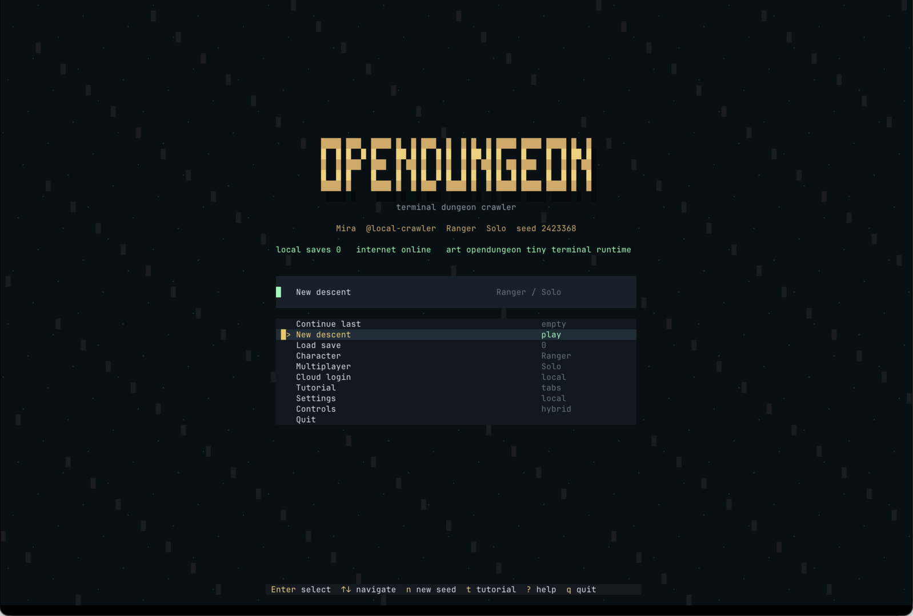

<h1 align="center">opendungeon</h1>

<p align="center">A terminal roguelike RPG built with OpenTUI.</p>

<p align="center">
  <a href="https://www.npmjs.com/package/@montekkundan/opendungeon"></a>
  <a href="https://github.com/Montekkundan/opendungeon/actions/workflows/release.yml"></a>
  <a href="LICENSE"></a>
</p>

<p align="center">
  
</p>

---

### Installation

```bash
# npm
npm i -g @montekkundan/opendungeon
opendungeon

# Bun uses the npm registry too
bun add -g @montekkundan/opendungeon
opendungeon
```

Check for upgrades:

```bash
opendungeon update
```

### Source Checkout

```bash
bun install
bun run dev
bun run verify:gameplay
```

Website:

```bash
bun run web
bun run web:verify
```

`bun run web` uses Portless, so the stable local URL is `https://opendungeon.localhost`. On the first run, Portless may ask you to trust its local certificate authority. Re-running the command restarts the existing `opendungeon.localhost` dev route instead of keeping a stale Next.js lock.

Supabase auth/profile setup uses the `opendungeon` project. Public local env files are already written for development; use the same values in Vercel:

```bash
NEXT_PUBLIC_SUPABASE_URL=https://uablylzrcindbreehbuj.supabase.co
NEXT_PUBLIC_SUPABASE_PUBLISHABLE_KEY=sb_publishable_o-QLR6jUUh04QCm58di_8w_7bP4MGNt
```

Keep service-role keys server-only. The Next.js website only needs the publishable key.

### Play Modes

- **Single Player** is the canonical authored story loop: local dungeon rules, lore, curated assets, village progression, and offline saves.
- **Multiplayer** uses that same story loop with multiple players sharing the run and village through a lobby host. `coop` is the shared-story lobby variant; `race` is only a same-seed challenge variant.
- **Multiplayer with GM** is a logged-in website flow for GM-created worlds. AI/GM lore, rooms, quests, and generated assets must stay per-world in Supabase and must not replace the Single Player story.

### Multiplayer

`127.0.0.1` and `localhost` only work on the same computer. For friends on the same Wi-Fi/LAN, host on `0.0.0.0` and share the LAN IP printed by the host.

```bash
# Same laptop, multiple terminal tabs
bun run host -- --host 127.0.0.1 --mode coop --seed 2423368 --port 3737
OPENDUNGEON_PLAYER_NAME=Mira bun run dev -- join http://127.0.0.1:3737
OPENDUNGEON_PLAYER_NAME=Nyx bun run dev -- join http://127.0.0.1:3737

# Same Wi-Fi / LAN
opendungeon-host --host 0.0.0.0 --mode coop --seed 2423368 --port 3737
curl http://YOUR_LAN_IP:3737/health
```

Friends join with:

```bash
opendungeon join http://YOUR_LAN_IP:3737
```

For source checkout testing on LAN, use the same command through Bun:

```bash
bun run host -- --host 0.0.0.0 --mode coop --seed 2423368 --port 3737
OPENDUNGEON_PLAYER_NAME=Sol bun run dev -- join http://YOUR_LAN_IP:3737
```

For an internet server, run `opendungeon-host` on a reachable machine, open TCP port `3737`, and set the public URL or domain:

```bash
opendungeon-host --host 0.0.0.0 --public-url http://YOUR_SERVER_IP:3737 --mode coop --seed 2423368 --port 3737
opendungeon join http://YOUR_SERVER_IP:3737
```

The live game is host-authoritative: the `opendungeon-host` process validates actions, keeps the deterministic command log, and broadcasts state. Vercel can host invite pages and `/gm`, while internet multiplayer needs a long-running host on a VPS, Docker platform, Fly/Render/Railway, or another WebSocket-capable service.

Vercel Sandbox is an experimental internet-host option for logged-in hosts who connect their own Vercel account. The product path would create a sandbox under the host player's Vercel team, run `opendungeon-host` there, expose its public URL, store the lobby in Supabase, and stop the sandbox when the session ends. It is not the default path yet because sandbox runtimes are time-limited and need account-linking, lifecycle, reconnect, and cleanup guardrails.

For local source testing:

```bash
bun run host -- --mode coop --seed 2423368 --port 3737
```

Signed-in accounts are protected from duplicate local play: opening a second Ghostty tab with the same saved login shows an already-in-game message. Guest/local tabs are allowed, so multiple players can join from one laptop without logging in.
`OPENDUNGEON_PLAYER_NAME` is process-local, so every guest tab can use a different crawler name without changing your saved profile.

### Contributing

Start with [CONTRIBUTING.md](CONTRIBUTING.md) for the repo map, local multiplayer test commands, website commands, and the checks expected before release-facing changes.

Docker/server hosting:

```bash
docker build -f packaging/docker/Dockerfile -t opendungeon-server .
docker run --rm -p 3737:3737 -e OPENDUNGEON_PUBLIC_URL=http://YOUR_SERVER_IP:3737 opendungeon-server --mode coop --seed 2423368
```

Ghost-style server platforms can use `packaging/ghost/opendungeon` as the game template. It follows Ghost's per-game compose-generator shape: `index.ts`, `install.ts`, and `settings.ts`.

### Publish

```bash
bun install --frozen-lockfile
bun run verify:contributor
bun run package:check
bun run changeset
git push origin main
```

The main-branch npm workflow opens a Changesets version PR and enables auto-merge for it. Once branch rules are satisfied, that version PR merges and the follow-up main run publishes the new npm version through npm Trusted Publishing. For Bun players, publish to npm; Bun installs global packages from the npm registry, so there is no separate Bun registry step.

### Release

```bash
bun run package:check
git tag v0.1.0
git push origin main --tags
```

The release workflow builds standalone macOS and Linux archives, checksums, a Homebrew formula, and an AUR `PKGBUILD`. npm package publishing is handled by the main-branch Changesets workflow.

### Features

- Procedural dungeon runs with fog of war, traps, secrets, NPCs, merchants, and bosses.
- Turn-based d20 combat with initiative, skills, status effects, reactions, and boss phases.
- RPG classes, stats, talents, equipment rarity, run mutators, and meta-progression.
- Local story, notes, collectibles, Book entries, cutscenes, and alternate ending hooks.
- Portal room and village systems for houses, farming, shops, trust, upgrades, and replayable runs.
- Local save management, autosave, export/import, cloud hooks, and multiplayer lobby state.
